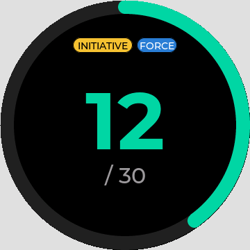
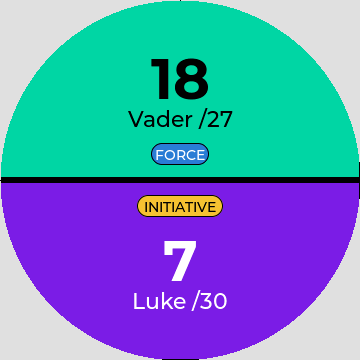
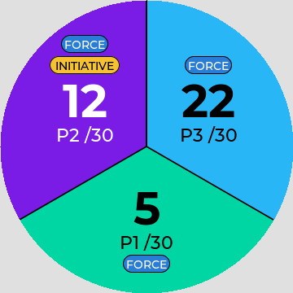
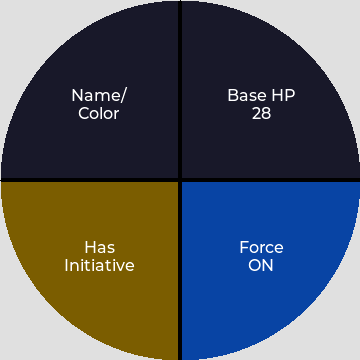

# Knobby SWU Base Counter

Base damage tracker for **Star Wars: Unlimited** on the Knobby rotary display. Turn the knob to deal damage, and the number counts up from 0 toward the base's HP.

Fork of [Knobby MTG Life Counter](https://github.com/knobby-mtg/knobby-mtg-life-counter) with the Magic features removed. Unofficial fan project, not affiliated with Lucasfilm, Disney or Fantasy Flight Games.

<p>
  
  
  
  
</p>

## Features

- Damage counter per base, 0 up to the base's HP, with a ring that fills as damage lands
- Base HP set per player (1–99), since every base has its own HP
- Base marked **DESTROYED** once damage reaches its HP
- Initiative token: one holder at a time, taking it moves it
- Force token per player
- Random initiative pick at the start of each game (roulette across the seats)
- 1 to 4 players on one device, plus optional multi-device Table Sync
- Round counter with game clock
- Coin flip
- Event log with undo
- Delta preview: the change shows for 3 seconds before it commits

Removed from the MTG version: life totals, commander damage, "damage to all", poison/tax/experience counters, mana pool, D20.

## Installation

Open the web installer in Chrome, Edge or Opera and follow the steps:

**https://farzsom.github.io/knobby-swu-life-counter/**

> [!Warning]
> Installation is at your own risk.

## Controls

| Action | How |
|---|---|
| Deal damage / heal | Turn knob clockwise / counter-clockwise |
| Pick a player (2–4 players) | Tap their area, then turn the knob |
| Player menu | Hold a player's area |
| Main menu | Swipe in from any edge |
| Back | Swipe down, or in from the right edge |
| Next round | Tap the round line (1 player, after starting the Round Timer) |

### Player menu

| Tile | Effect |
|---|---|
| Name/Color | Rename, pick a color, or color by remaining HP |
| Base HP | Set this player's base HP with the knob. Hold to concede (2+ players) |
| Initiative | Take the initiative, or tap again to clear it |
| Force | Toggle the Force token |

### Main menu

| Tile | Contents |
|---|---|
| Settings | Brightness, auto-dim, colors, deselect timeout, orientation, auto-elimination, multi-select, Table Sync, screen rotation |
| Game Mode | Players (1–4), Base HP for everyone, Random Initiative, Apply (hold) |
| Tools | Coin Flip, Round Timer, Event Log, Pick First |
| Reset (hold) | New game: damage and tokens clear, base HP stays |

Game Mode → Base HP sets every base. Player menu → Base HP sets one base.

## Hardware

Same board as the original project: JC3636K518 with battery, sold on AliExpress.

- 1.8 inch round display, 360×360
- Display driver: ST77916
- Touch: CST816
- ESP32-S3, 240 MHz

The [Waveshare ESP32-S3-Knob-Touch-LCD-1.8](https://www.waveshare.com/wiki/ESP32-S3-Knob-Touch-LCD-1.8) and the JC3636K718 may also work, depending on hardware revision.

## Publishing

The **Build and Publish** workflow compiles the firmware on GitHub:

- Every push to `main` rebuilds the web installer on GitHub Pages.
- Every tag starting with `v` also creates a GitHub release with the binaries zipped.

```bash
git tag v1.0.0
git push origin v1.0.0
```

One-time setup: under Settings → Pages, set Source to **GitHub Actions**.

## Building

All commands run from the repo root:

```bash
# First time: install Arduino cores and libraries
make firmware-deps

# Compile firmware for ESP32-S3
make firmware

# Flash to device (replace port with yours from `arduino-cli board list`)
make firmware-flash PORT=/dev/ttyACM0
```

## Simulator

A headless simulator renders the UI to PNG without hardware:

```bash
make screenshot ARGS="--screen 2p --track 2 --damage 7,18 --player-hp 30,27 --initiative 0"
make generate-matrix   # every screen and state, plus an index.html gallery
```

Run `sim/knobby_sim --help` for all options. The interactive PC simulator builds with `make sim`, and the browser simulator with `make sim-web-build` (needs Emscripten).

## License

GPL-3.0, same as the upstream project. See [LICENSE](LICENSE) and [THIRD_PARTY_NOTICES.md](THIRD_PARTY_NOTICES.md).
